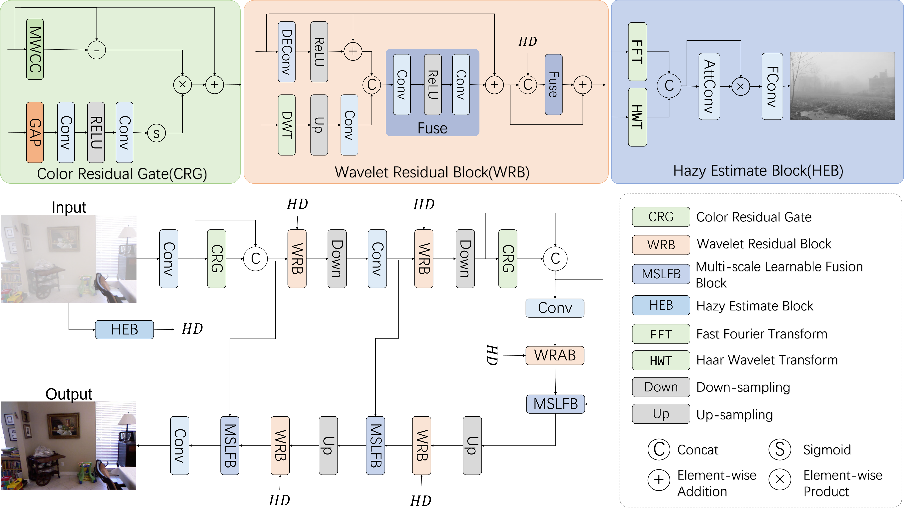
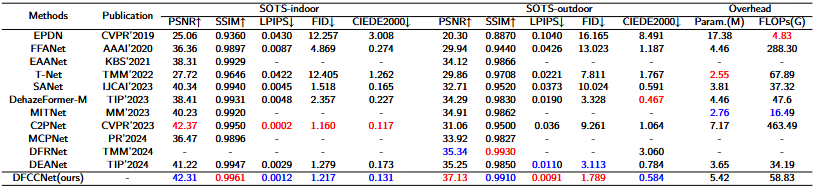
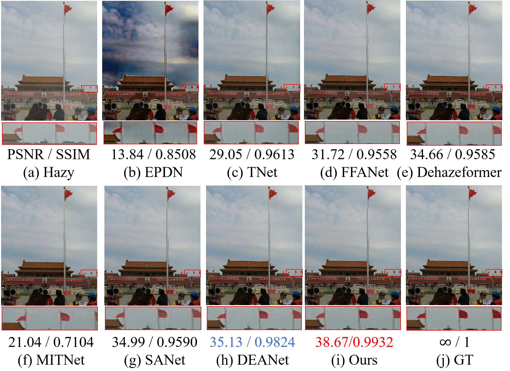
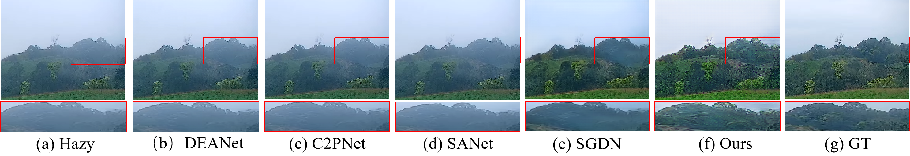

# DFCCNet: Unified Dual-domain Fusion and Color-aware Residual Correction for Robust Single Image Dehazing
Abstract
===========================
Image dehazing is a key task in image enhancement and restoration, with wide-ranging applications in various downstream tasks. To address the limitations of existing methods in detail recovery and color distortion, we propose an end-to-end dehazing network called Dual-domain Fusion and Color Correction Network (DFCCNet). Specifically, we first design a Haze Estimation Block to obtain more accurate haze density priors. Then, the network uses wavelet transform to extract multi-scale frequency sub-band features and fuses them with spatial domain features to enhance the representation of haze layers and edge structures. Guided by haze priors, the improved features help avoid background misinterpretation and edge blurring. Meanwhile, to address color shifts often caused by halo removal, we introduce a Color Residual Gate module, which effectively restores realistic and natural color distributions through color correction and residual signal modulation. Finally, we propose a learnable fusion mechanism to enable adaptive interaction and reconstruction between different features, promoting visually friendly and perceptual enhancement. Experimental results show that DFCCNet achieves competitive performance in both visual quality and quantitative metrics on multiple benchmark datasets.



📄 Preparation
===========================
### Clone the repo

```sh
https://github.com/wenchao-tech/DFCCNet-main.git
cd DFCCNet-main/
```
## 💻 Install
You can create a new conda environment:
```
conda create -n DFCCNet python=3.8
conda activate DFCCNet
pip install torch==2.2.1 torchvision==0.17.1 torchaudio==2.2.1 --index-url https://download.pytorch.org/whl/cu118
```

## 👉 Datasets

We used [SOTS-indoor](https://sites.google.com/view/reside-dehaze-datasets/reside-v0), [SOTS-outdoor](https://sites.google.com/view/reside-dehaze-datasets/reside-v0) and [Haze4K](https://github.com/liuye123321/DMT-Net) for testing. In addition, we also conducted tests on real-world datasets, including O-HAZE and RW2AH.

For training, we used [ITS](https://sites.google.com/view/reside-dehaze-datasets/reside-standard) dataset.
Make sure the file structure is consistent with the following:

```
dataset/
├── HAZE4K
│   ├── test
│   |   ├── clear
│   |   │   ├── 1.png
│   |   │   └── 2.png
│   |   │   └── ...
│   |   └── hazy
│   |       ├── 1_0.89_1.56.png
│   |       └── 2_0.93_1.66.png
│   |       └── ...
│   └── train
│       ├── clear
│       │   ├── 1.png
│       │   └── 2.png
│       │   └── ...
│       └── hazy
│           ├── 1_0.68_0.66.png
│           └── 2_0.59_1.95.png
│           └── ...
├── ITS
│   ├── test
│   |   ├── clear
│   |   │   ├── 1400.png
│   |   │   └── 1401.png
│   |   │   └── ...
│   |   └── hazy
│   |       ├── 1400_1.png
│   |       └── ...
│   |       └── 1400_10.png
│   |       └── 1401_1.png
│   |       └── ...
│   └── train
│       ├── clear
│       │   ├── 1.png
│       │   └── 2.png
│       │   └── ...
│       └── hazy
│           ├── 1_1_0.90179.png
│           └── ...
│           └── 1_10_0.98796.png
│           └── 2_1_0.99082.png
│           └── ...
└── OTS
    ├── test
    |   ├── clear
    |   │   ├── 0001.png
    |   │   └── 0002.png
    |   │   └── ...
    |   └── hazy
    |       ├── 0001_0.8_0.2.jpg
    |       └── 0002_0.8_0.08.jpg
    |       └── ...
    └── train
        ├── clear
        │   ├── 0005.jpg
        │   └── 0008.jpg
        |	└── ...
        └── hazy
            ├── 0005_0.8_0.04.jpg
            └── 0005_1_0.2.jpg
            └── ...
            └── 0008_0.8_0.04.jpg
            └── ...
```

## 🚀 Training and Test
> 🔧 **Coming soon!**
The pre-trained weights of our model will be released soon.

Training
Run the following script to train DFCCNet from scratch:
```
CUDA_VISIBLE_DEVICES=0 python train.py --epochs 300 --iters_per_epoch 5000 --finer_eval_step 1400000 --w_loss_L1 1.0 --w_loss_CR 0.1 --start_lr 0.0001 --end_lr 0.000001 --exp_dir ../experiment/ --model_name DFCCNet --dataset ITS
```
Testing
Run the following script to test the trained model：
```
python3 eval.py --dataset (dataset name) --model_name (model name) --pre_trained_model (Test sample address)
```
## 📊 Results
### Results


### Dehazing results on SOTS-indoor


### Dehazing results on SOTS-outdoor


### Dehazing results on Haze4K


### Dehazing results on RW2AH

